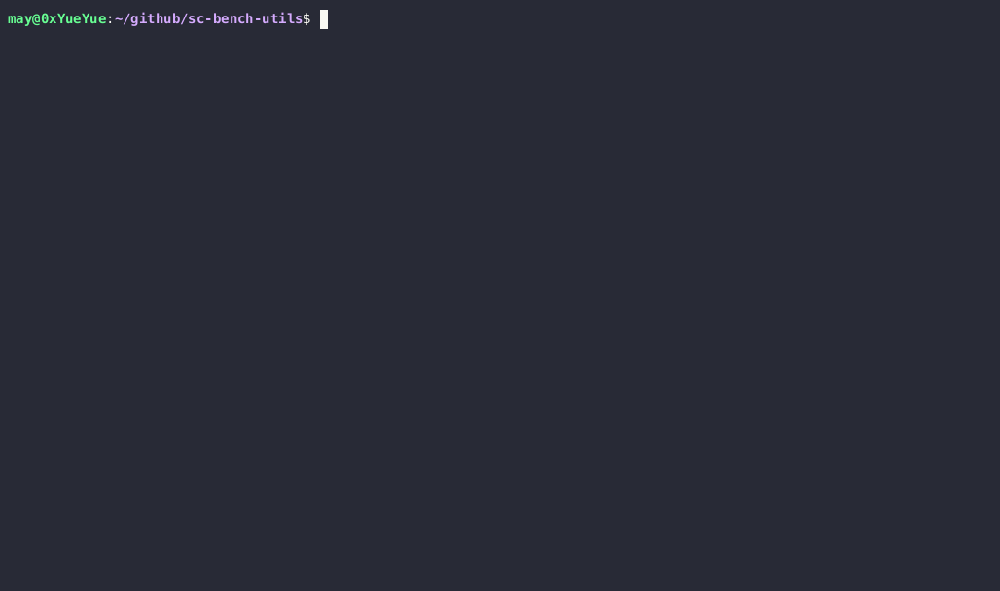

# sc-bench-utils
Some basic utilities for benchmarking in scopes.

# Examples
Let's say we want to time some function called double-it.

```scopes
fn double-it (a)
	a * 2
```

```scopes
using import .time
using import format

for x in (range 0 10)
	let duration = (time-it double-it x)

	print
		.. (format "{} took {}s" double-it duration)	
```

# Functions
`time-it (func args...)`: takes a functions and returns the completion duration in (seconds + nanoseconds) (f64). 

`time-trial (func iterations args...)`: takes a function and the number of iterations to be ran. returns the average time it took to run in (seconds + nanoseconds) (f64).

# Demo


